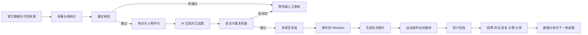
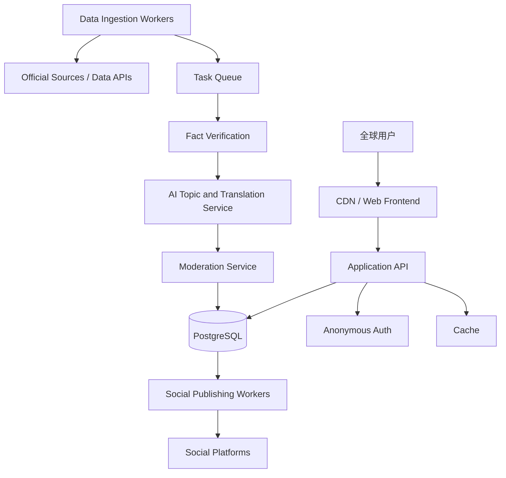

# VileSaint 完整产品文档

> 文档版本：V1.0  
> 更新日期：2026-06-13  
> 产品域名：https://vilesaint.com  
> 产品形态：面向全球足球球迷的多语言独立站  
> 核心主题：比赛争议、人物审判、球迷对立、图片分享、AI 自动运营

---

## 1. 文档目的

本文档是 VileSaint 的产品、设计、开发、AI 自动化、内容运营和上线验收依据。

它解决以下问题：

1. 明确 VileSaint 是什么、服务谁、为什么用户愿意参与和分享。
2. 明确网站所有页面、功能、数据和交互规则。
3. 明确 AI 如何自动发现热点、核验事实、创建人物话题并发布到社交媒体。
4. 明确评论、匿名身份、图片分享、多语言和内容安全机制。
5. 明确哪些能力已经上线，哪些属于完整自动化目标。

---

## 2. 产品定义

### 2.1 一句话定义

VileSaint 是一个把足球比赛中的人物和争议事件变成全球公开审判的多语言球迷社区。

### 2.2 产品核心

每场比赛都会产生英雄、罪人、争议人物和对立观点。

VileSaint 不做传统新闻门户，也不做完整比分工具。它只做一件事：

> 在事实已经确认的基础上，把最值得争论的人物或事件包装成一个足够尖锐的话题，让全球球迷快速站队、评论、回复和分享。

### 2.3 独立站定义

独立站是由品牌自己拥有域名、页面、用户关系和数据的互联网产品。

VileSaint 不依赖某个社交平台才能存在。社交平台负责传播，`vilesaint.com` 负责承接用户、沉淀评论和形成社区。

独立站的核心价值：

- 域名和品牌归自己所有。
- 页面规则和视觉体验由自己控制。
- 用户数据和社区关系可以持续积累。
- 不会因单一平台限流而完全失去用户。
- 可同时服务不同国家、语言和社交平台。

---

## 3. 产品目标

### 3.1 总目标

在没有付费推广预算的情况下，依靠世界杯热点、人物冲突、球迷对立和图片分享获得自然流量。

### 3.2 用户目标

用户进入网站后，应在 5 秒内明白：

1. 当前讨论的是哪场比赛。
2. 当前审判的是哪个人物或事件。
3. 自己可以选择哪一边。
4. 自己可以直接评论，不需要注册。
5. 自己可以把观点做成图片分享出去。

### 3.3 业务目标

- 建立具有识别度的全球足球争议品牌。
- 形成“热点出现后来看 VileSaint”的用户心智。
- 通过分享图片和评论图片产生站外回流。
- 沉淀匿名但可持续识别的球迷社区。
- 用 AI 降低内容生产、翻译和运营成本。

### 3.4 非目标

VileSaint 当前不以以下方向为核心：

- 不做全量比分应用。
- 不做博彩预测或投注建议。
- 不做盗版直播。
- 不做传统长篇新闻媒体。
- 不在当前阶段依赖广告变现。
- 不要求用户填写邮箱、手机号或建立完整账号。

---

## 4. 产品原则

### 4.1 事实先于冲突

可以制造观点冲突，但不能制造比赛事实。

- 未开球不得写成已开球。
- 未结束不得写成已完赛。
- 不得编造比分、进球球员、红牌、判罚或用户数据。
- 数据无法确认时不自动发布。
- 观点性标题必须建立在已核验事实之上。

### 4.2 人物先于泛话题

“大家聊聊比赛”过于宽泛，不利于冲突和传播。

每个主要评论线程必须绑定一个明确对象：

- 某位球员。
- 某位教练。
- 某位裁判。
- 某位门将。
- 某个明确事件。

优先级为：人物话题 > 明确事件 > 泛比赛话题。

### 4.3 无登录摩擦

用户第一次访问时自动创建匿名身份，不展示注册页面。

### 4.4 分享即内容

每一次站队和评论都应能生成一张可独立传播的图片。图片必须让没有打开网站的人也能理解冲突，同时通过二维码和域名带回流量。

### 4.5 全球化但不复杂

界面默认自动匹配语言，用户可以手动切换。核心操作不依赖文字说明也能理解。

### 4.6 自动化但可追责

AI 可以自动发现、生成、翻译和发布，但每条内容必须保存来源、核验状态、生成记录和发布时间。

---

## 5. 目标用户

### 5.1 核心用户

- 世界杯期间关注比赛的普通球迷。
- 喜欢争论球员表现和裁判判罚的用户。
- 喜欢制作观点图并发到社交媒体的用户。
- 不愿注册账号但愿意快速评论的用户。
- 来自不同国家、使用不同语言的球迷。

### 5.2 用户动机

VileSaint 主要利用以下人性驱动力：

- 阵营认同：支持自己的国家、球队和球员。
- 胜负欲：希望自己的观点赢过另一方。
- 表达欲：希望公开说出别人不敢说的话。
- 冲突吸引：对争议、失误、逆转和对立天然敏感。
- 社会认同：关注有多少人赞同自己。
- 身份展示：通过图片表达“我站哪边”。
- 围观心理：查看其他国家球迷如何评价同一个人物。

### 5.3 典型场景

1. 用户在社交媒体看到一张评论争议图。
2. 扫描二维码或点击链接进入人物话题。
3. 看到事实、人物和冲突问题。
4. 投票站队。
5. 直接使用匿名 ID 评论。
6. 回复或点赞其他球迷。
7. 把自己的评论生成图片再次分享。

---

## 6. 品牌定位

### 6.1 品牌名称

VileSaint

名称由 `Vile` 与 `Saint` 组成，表达同一个人物可能同时被不同球迷视为恶人或圣徒。

### 6.2 品牌口号

主口号：

> Every match creates a saint and a villain.

中文表达：

> 每一场比赛都会诞生圣徒和恶人。

辅助口号：

> The world decides which is which.

### 6.3 品牌语气

- 简短。
- 尖锐。
- 戏剧化。
- 有判断感。
- 不使用新闻稿式长句。
- 不侮辱种族、国籍、性别、宗教或身体特征。
- 冲突针对比赛行为和公开表现，不针对不可改变的个人属性。

### 6.4 视觉风格

- 主色：黑色。
- 冲突色：红色。
- 荣誉色：金黄色。
- 文字：高对比、压缩型大标题。
- 视觉关键词：法庭、判决、档案、印章、警报、审判。
- 移动端优先，首屏必须强烈但不能拥挤。

---

## 7. 信息架构

### 7.1 当前核心页面

网站采用“多主题 PK 首页 + 独立主题评论线程”的体验，主要由以下区域组成：

1. 顶部品牌与语言切换。
2. 已核验比赛结果。
3. 当前主推 PK 主题。
4. 多主题 PK 广场。
5. 赛前、直播、赛后和赛事预测筛选。
6. 每个主题自己的两方站队按钮。
7. 当前主题详情和专属评论线程。
8. 匿名评论、回复与点赞。
9. 品牌宣言。
10. 语言选择与分享海报弹窗。

### 7.2 完整目标页面

- `/`：实时首页。
- `/case/{case-slug}`：事件审判页。
- `/person/{person-slug}`：人物审判页。
- `/match/{match-slug}`：单场比赛话题集合。
- `/rankings`：圣徒榜与恶人榜。
- `/about`：产品说明和免责声明。
- `/community-guidelines`：社区规则。
- `/privacy`：隐私政策。
- `/terms`：服务条款。

首版可继续使用单页，但所有数据对象必须具备独立 slug，为未来独立 URL 做准备。

---

## 8. 首页功能

### 8.0 多主题 PK 广场

首页不是单一话题页面，而是持续刷新的主题集合。

每张主题卡包含：

- 主题状态：赛前、直播、已完赛或预测。
- 关联比赛或赛事。
- 主题人物、球队或榜单。
- 一个明确 PK 问题。
- 两个互斥选项。
- 卡片内快速投票。
- “进入主题评论区”入口。

主题分类：

- 赛前预测：看好谁赢、谁会首发、谁能进球。
- 直播争议：实时判罚、换人、球员表现和比赛走势。
- 赛后审判：关键先生、背锅人物、战术成败。
- 冠军预测：看好谁夺冠、黑马、金靴和最佳球员。
- 看衰榜：最可能翻车的热门球队或被高估人物。

每个主题使用唯一 `topic_id/slug`。投票、评论、回复、点赞、分享图和二维码必须绑定同一个主题。

### 8.1 实时比赛事实卡

显示内容：

- 比赛状态。
- 对阵双方。
- 最终比分或当前比分。
- 比赛阶段。
- 关键球员。
- 数据核验状态。

业务规则：

- 只有官方或可信来源确认后才显示 `VERIFIED`。
- 未结束比赛必须显示实时状态和数据更新时间。
- 已结束比赛显示 `FINAL`。
- 信息源发生冲突时，页面进入待核验状态，不显示未经确认的内容。

### 8.2 核心判决问题

每个页面只能有一个最主要的问题。

问题结构：

> 人物/事件 + 两种对立解释

示例：

- 关键先生，还是吃了东道主红利？
- 英雄救主，还是前 80 分钟毫无贡献？
- 战术大师，还是运气站在了他这边？
- 合理对抗，还是足以改变比赛的犯规？

禁止：

- 没有事实依据的人身攻击。
- 涉及种族、宗教、性取向等受保护属性的煽动。
- 把未经确认的传闻写成事实。

### 8.3 双方站队

用户选择两个互斥观点之一。

功能要求：

- 单次点击完成投票。
- 同一设备同一话题默认保留最后一次选择。
- 不同主题的选择互不覆盖。
- 投票后突出用户选择。
- 显示真实统计前，不展示虚构比例。
- 投票结果可随真实数据实时更新。

### 8.4 结果区

显示：

- 用户选择。
- 真实投票比例。
- 总投票数。
- 各国家或语言区域的观点差异。
- 分享入口。

无足够样本时：

- 不显示“全球多数”。
- 可以显示“数据正在形成”。
- 国家分布低于隐私阈值时不单独展示。

---

## 9. 人物主题系统

### 9.1 定义

主题是评论社区的最小讨论单位。主题可以绑定人物、球队、比赛事件或赛事预测；人物主题仍是赛后冲突内容的优先形式。

每个主题必须包含：

- 人物姓名。
- 人物类型：球员、教练、裁判等。
- 所属球队或国家。
- 关联比赛。
- 已核验事实。
- 一个对立问题。
- 主题唯一 slug。
- 创建时间和状态。

### 9.2 当前上线主题

- 人物：劳尔·希门尼斯。
- 关联比赛：墨西哥 2–0 南非。
- 已核验事实：在该场已完赛比赛中取得进球。
- 争议问题：关键先生，还是吃了东道主红利？
- 主题 slug：`raul-jimenez-mexico-south-africa-2026`。

### 9.3 主题选择规则

AI 为每场比赛计算人物话题分数：

`话题分 = 争议强度 + 人物知名度 + 比赛影响 + 情绪对立 + 可验证性 + 分享潜力`

优先选择：

- 决定比赛的人。
- 出现重大失误的人。
- 引发判罚争议的人。
- 替补登场改变比赛的人。
- 赛后采访产生冲突的人。
- 不同国家评价明显相反的人。

### 9.4 主题状态

- `draft`：AI 已生成，未完成核验。
- `verified`：事实已核验，可发布。
- `live`：正在首页推荐。
- `closed`：停止推荐，但保留评论。
- `retracted`：事实错误或风险过高，撤回展示。

### 9.5 主题与评论绑定

- 一个主题对应一个独立 `case_slug`。
- 用户从首页进入某主题后，只加载该 slug 的评论。
- 实时订阅在切换主题时同步切换。
- 分享评论时，URL 同时携带主题 slug 和评论 ID。
- 打开分享链接后先恢复主题，再定位对应评论。

---

## 10. 匿名用户系统

### 10.1 用户体验

用户不需要输入用户名、密码、邮箱或手机号。

首次访问时：

1. 系统创建匿名认证会话。
2. 自动生成球迷 ID，例如 `VS-A1B2C3`。
3. 在同一浏览器设备中持续保留该身份。
4. 用户可以直接投票、评论、回复和点赞。

### 10.2 记录范围

系统仅记录产品运行必要信息：

- 匿名用户 UUID。
- 对外展示的匿名球迷 ID。
- 语言。
- 时区。
- 设备类别：手机、平板、桌面。
- 创建时间。
- 最近活动时间。

默认不采集：

- 姓名。
- 手机号。
- 邮箱。
- 精确地址。
- 通讯录。
- 麦克风或相机。
- 可公开查询的完整设备指纹。

### 10.3 隐私规则

- 公共接口只能读取匿名球迷 ID。
- 语言、时区和设备类别不向其他用户公开。
- 不在前端暴露数据库管理密钥。
- 删除匿名账号时，相关数据按社区规则处理。

---

## 11. 评论系统

### 11.1 评论范围

每条评论必须属于一个人物主题或明确事件，不能进入无主题公共聊天室。

### 11.2 功能

- 发布评论。
- 回复评论。
- 点赞和取消点赞。
- 实时加载新评论。
- 显示匿名球迷 ID。
- 标记自己的评论。
- 显示相对发布时间。
- 分享单条评论。
- 分享链接打开后定位并高亮对应评论。

### 11.3 字数与层级

- 评论长度：1–500 字符。
- 回复默认只保留两层视觉结构。
- 回复更深层评论时，系统归入根评论线程，避免无限嵌套。
- 用户输入必须使用纯文本渲染，禁止执行 HTML。

### 11.4 排序

默认建议采用混合排序：

1. 主题发布后前 30 分钟按时间排序。
2. 形成讨论后按热度排序。
3. 用户可切换“最新”和“最热”。

热度可由以下指标计算：

`热度 = 点赞数 × 2 + 回复数 × 3 + 分享数 × 4 - 时间衰减`

### 11.5 防刷

当前规则：

- 同一匿名用户每分钟最多发布 5 条评论。
- 30 秒内禁止发布完全相同的内容。
- 同一用户对同一评论只能点赞一次。

完整目标：

- 增加 IP/网络层限流。
- 增加异常匿名账号创建限制。
- 增加敏感内容审核。
- 增加重复文本和批量模板检测。
- 增加举报、折叠和封禁能力。

---

## 12. 分享系统

### 12.1 分享目标

分享不是辅助功能，而是 VileSaint 的核心增长机制。

每张分享图必须具备：

- VileSaint 品牌。
- 明确人物或比赛。
- 一句可读的冲突问题。
- 用户观点或评论。
- 大尺寸二维码。
- `vilesaint.com` 域名。
- 清晰回流动作。

### 12.2 判决海报

尺寸：1080 × 1350 PNG。

内容：

- 品牌名称。
- 比赛和比分。
- 核心问题。
- 用户选择。
- 官方结果标识。
- 回流二维码。

操作：

- 立即分享。
- 保存图片到相册。
- 复制链接。
- 关闭分享弹窗。

移动端行为：

- 优先调用系统图片分享。
- iOS 用户可在系统分享面板选择“存储到照片”。
- Android 用户可保存或分享到支持的应用。
- 浏览器不支持文件分享时，自动下载 PNG。

### 12.3 评论分享图

尺寸：1080 × 1350 PNG。

内容：

- 人物姓名。
- 人物主题问题。
- 匿名球迷 ID。
- 评论原文。
- 评论时间。
- VileSaint 品牌。
- 大二维码。
- 评论直达链接。

站外传播后，用户点击或扫码应进入对应人物主题，并定位到该评论。

### 12.4 二维码规则

- 二维码必须有足够留白。
- 不得被水印、文字或装饰覆盖。
- 图片缩小到社交媒体预览尺寸后仍可识别。
- 不同人物主题应使用带主题参数的动态二维码。
- 所有二维码链接必须使用 HTTPS。

---

## 13. 多语言系统

### 13.1 当前语言

语言选择器当前包含：

- 英语。
- 西班牙语。
- 葡萄牙语。
- 法语。
- 德语。
- 意大利语。
- 荷兰语。
- 波兰语。
- 土耳其语。
- 阿拉伯语。
- 印尼语。
- 越南语。
- 泰语。
- 简体中文。
- 繁体中文。
- 日语。
- 韩语。
- 印地语。

核心产品文案当前重点完成英语、简体中文、西班牙语、日语和韩语。

### 13.2 语言选择

优先级：

1. 用户手动选择的语言。
2. 浏览器语言。
3. 英语兜底。

### 13.3 AI 翻译流程

1. 先生成事实层结构化内容。
2. 锁定姓名、比分、时间和球队等不可改字段。
3. 生成源语言争议标题。
4. 翻译到目标语言。
5. 使用第二个模型检查事实一致性和语气。
6. 高风险内容进入人工审核队列。

### 13.4 本地化原则

- 不做逐字直译。
- 球员姓名采用当地常见译名。
- 保留球队官方名称。
- 避免不同文化中严重冒犯性的表达。
- 阿拉伯语界面支持从右到左。

---

## 14. AI 热点发现系统

### 14.1 输入源

优先级从高到低：

1. FIFA、赛事组织方和官方比赛中心。
2. 球队、球员和教练官方账号。
3. 获得授权或允许使用的体育数据 API。
4. 可信新闻机构。
5. 社交平台公开趋势信号。

社交媒体内容只能作为“热点信号”，不能单独作为比赛事实来源。

### 14.2 抓取内容

- 比分和比赛状态。
- 进球、助攻、红黄牌。
- 换人和关键时间点。
- VAR 与裁判事件。
- 球员表现数据。
- 赛后采访。
- 社交平台讨论速度和情绪。

### 14.3 热点评分

AI 每隔固定时间计算候选事件：

`爆点分 = 讨论增速 + 情绪对立 + 人物知名度 + 比赛重要性 + 跨国家差异 + 事实可信度`

只有达到阈值且事实可信度达标的候选，才能创建话题。

### 14.4 事实核验

每条事实至少保存：

- 原始来源 URL。
- 来源类型。
- 抓取时间。
- 事件时间。
- 原文摘要。
- 结构化事实。
- 核验状态。
- 冲突来源。

发布条件：

- 比分等关键事实必须有官方来源，或两个高可信来源一致。
- 只被单一社交账号提及的事件不得自动发布为事实。
- 来源互相冲突时停止自动发布。

---

## 15. AI 话题生成

### 15.1 生成输入

- 已核验比赛事实。
- 候选人物。
- 人物影响。
- 各地区讨论差异。
- 已存在话题，防止重复。
- 社区安全规则。

### 15.2 生成输出

AI 输出结构化对象：

```json
{
  "subject_type": "player",
  "subject_name": "Raul Jimenez",
  "match_id": "official-match-id",
  "verified_fact": "Scored in Mexico's 2-0 win",
  "question": "Match-winner or home advantage beneficiary?",
  "side_a": "Match-winner",
  "side_b": "Home advantage",
  "risk_level": "low",
  "source_ids": ["source-1"]
}
```

### 15.3 生成规则

- 标题必须能形成两个合理阵营。
- 两边都必须有用户愿意选择。
- 不允许把侮辱性称呼作为人物标签。
- 不允许 AI 生成虚构引语。
- 不允许把统计推断写成事实。
- 每个人物在同一比赛中默认只创建一个主话题。

### 15.4 发布前检查

- 事实检查。
- 重复检查。
- 语言检查。
- 诽谤和侮辱检查。
- 未成年人和敏感人物检查。
- 图片版权检查。
- 时间状态检查。

---

## 16. 社交媒体自动发布

### 16.1 目标平台

根据 API、地区和账号权限逐步接入：

- X。
- Instagram。
- Facebook。
- Threads。
- TikTok。
- YouTube Community。
- 微博。

不同平台必须使用官方 API 或被允许的发布方式，不使用违反平台规则的自动化。

### 16.2 发布内容

每个热点自动生成：

- 一条短标题。
- 一张人物争议图。
- 两方观点。
- 话题链接。
- 平台适配标签。
- 对应语言版本。

### 16.3 发布策略

- 官方事实确认后发布。
- 同一事件不在短时间重复发布。
- 根据平台受众选择语言。
- 高风险话题需要人工批准。
- 发布失败进入重试队列。
- 多次失败后停止重试并报警。

### 16.4 回流

每个平台使用独立追踪参数：

```text
https://vilesaint.com/person/raul-jimenez?utm_source=x&utm_campaign=worldcup
```

统计：

- 展示量。
- 点击量。
- 到站用户。
- 投票转化。
- 评论转化。
- 分享转化。

---

## 17. 自动化工作流



### 17.1 时间要求

- 重大事件发生后 1–3 分钟内进入候选池。
- 官方确认后 1 分钟内完成结构化。
- 低风险话题 2 分钟内生成并发布。
- 高风险话题等待人工审核。

### 17.2 比赛状态刷新

采用双层刷新：

1. 浏览器每 60 秒重新读取主题数据。
2. GitHub Actions 每 5 分钟检查赛程、比赛状态和比分变化。

状态变化：

- 开球前：主题分类为 `prematch`，问题以预测为主。
- 比赛中：自动变为 `live`，刷新比分和直播问题。
- 比赛结束：自动变为 `final`，保留原评论并生成赛后主题候选。

数据源失败时：

- 保留最后一次成功数据。
- 页面显示最后更新时间。
- 不把预测内容自动标记为已核验事实。
- `VERIFIED` 只用于经过官方来源复核的事实。

---

## 18. 内容安全与社区治理

### 18.1 允许

- 批评球员比赛表现。
- 讨论战术、失误、判罚和采访。
- 有情绪但不涉及仇恨的球迷对立。
- 针对公开比赛行为的讽刺。

### 18.2 禁止

- 种族歧视。
- 国籍仇恨。
- 宗教攻击。
- 性别或性取向攻击。
- 人肉搜索。
- 威胁和鼓励暴力。
- 泄露私人信息。
- 未经证实的严重指控。
- 冒充球员、球队或官方机构。
- 垃圾广告和自动灌水。

### 18.3 审核层级

- L0：规则过滤，如链接、重复文本和敏感词。
- L1：AI 语义审核。
- L2：用户举报与自动降权。
- L3：人工复核和封禁。

### 18.4 处置

- 正常展示。
- 降低排序。
- 折叠并提示原因。
- 删除评论。
- 限制发布。
- 冻结匿名身份。
- 对严重违法内容保留必要审计记录。

---

## 19. 数据模型

### 19.1 已上线核心表

#### `fan_profiles`

- `user_id`
- `fan_tag`
- `language`
- `timezone`
- `device_class`
- `created_at`
- `last_seen_at`

#### `comments`

- `id`
- `case_slug`
- `author_id`
- `parent_id`
- `body`
- `created_at`
- `edited_at`

#### `comment_likes`

- `comment_id`
- `user_id`
- `created_at`

### 19.2 完整目标表

- `matches`：比赛。
- `match_events`：比赛事件。
- `people`：球员、教练、裁判。
- `cases`：人物或事件主题。
- `case_sources`：事实来源。
- `votes`：用户站队。
- `fan_profiles`：匿名身份。
- `comments`：评论。
- `comment_likes`：点赞。
- `comment_reports`：举报。
- `share_events`：分享。
- `social_posts`：社交发布记录。
- `translations`：多语言内容。
- `moderation_actions`：审核记录。
- `automation_runs`：AI 自动化执行记录。

主题至少包含：

- `slug`
- `category`
- `theme_mode`
- `status`
- `subject`
- `question`
- `fact`
- `left_option`
- `right_option`
- `match_id`
- `kickoff_at`
- `verified`
- `source`
- `priority`

---

## 20. 技术架构

### 20.1 当前架构

- 前端：HTML、CSS、JavaScript。
- 托管：GitHub Pages。
- 域名：`vilesaint.com`。
- 数据库与认证：Supabase。
- 用户身份：Supabase Anonymous Auth。
- 实时评论：Supabase Realtime。
- 数据权限：PostgreSQL Row Level Security。
- 图片生成：浏览器 Canvas 输出 PNG。

### 20.2 完整自动化架构



### 20.3 架构决策

#### ADR-001：匿名身份代替传统注册

原因：降低首次参与门槛。

代价：跨设备身份不能自动合并，滥用控制更困难。

应对：保留未来绑定邮箱或社交账号的可选能力，但不作为参与前提。

#### ADR-002：结构化事实与生成文案分离

原因：防止 AI 改写比分、姓名和时间。

规则：事实字段只由数据层写入，AI 只能生成观点标题和语言表达。

#### ADR-003：人物主题作为评论数据边界

原因：提高讨论聚焦度，并使分享图有明确对象。

#### ADR-004：图片在客户端生成

原因：当前成本低、速度快、不需要单独图片服务。

未来：流量扩大后增加服务端渲染，确保字体、二维码和平台预览完全一致。

---

## 21. 非功能要求

### 21.1 性能

- 移动端首屏核心内容尽量在 2.5 秒内可见。
- 主 JavaScript 不阻塞首屏阅读。
- 图片使用合适尺寸和缓存。
- 评论首屏最多加载 250 条，更多内容分页。

### 21.2 可用性

- 评论服务失败时，比赛和判决内容仍可浏览。
- 社交发布失败不能影响网站话题发布。
- 数据源中断时显示最后核验时间，不继续生成新事实。

### 21.3 安全

- 所有流量使用 HTTPS。
- 数据表启用 RLS。
- 管理密钥只保存在服务端密钥系统。
- 用户内容纯文本输出。
- API 请求限流。
- 定期审查依赖和 CDN 风险。

### 21.4 可访问性

- 按钮具备可读名称。
- 颜色不是唯一状态提示。
- 支持键盘关闭弹窗。
- 动画遵循 `prefers-reduced-motion`。
- 文字与背景保持足够对比度。

---

## 22. 数据真实性规范

### 22.1 核心红线

以下内容不得由 AI 猜测：

- 比分。
- 比赛状态。
- 开球时间。
- 进球球员。
- 红黄牌。
- 点球和 VAR 结果。
- 用户数量。
- 投票比例。
- 国家分布。

### 22.2 页面标记

- `LIVE`：比赛正在进行，包含更新时间。
- `FINAL`：比赛已经结束。
- `VERIFIED`：关键事实已通过规则核验。
- `DEVELOPING`：信息仍在发展，不展示确定性结论。
- `RETRACTED`：内容被撤回并说明原因。

### 22.3 更正机制

发现错误后：

1. 立即停止社交自动发布。
2. 页面撤下错误内容。
3. 保存原内容和更正原因。
4. 发布更正版本。
5. 已发布社交内容按平台能力删除或回复更正。

---

## 23. 数据指标

### 23.1 北极星指标

每个主题的有效参与人数：

> 完成投票、评论、回复或分享中至少一项的独立匿名用户数。

### 23.2 核心漏斗

1. 访问。
2. 查看核心主题。
3. 投票。
4. 查看评论。
5. 发布评论或回复。
6. 生成分享图。
7. 完成站外分享。
8. 分享带来的新用户回流。

### 23.3 关键指标

- 日活匿名用户。
- 单主题访问人数。
- 投票转化率。
- 评论转化率。
- 回复率。
- 点赞率。
- 图片生成率。
- 分享完成率。
- 二维码回流率。
- 社交平台到站率。
- 7 日匿名用户回访率。
- 每个话题的事实纠错率。
- 内容审核命中率。

### 23.4 初期目标建议

- 首屏到投票转化率：≥ 20%。
- 投票后分享按钮点击率：≥ 8%。
- 评论用户占访问用户：≥ 3%。
- 评论分享图生成率：≥ 10%。
- 页面移动端无横向溢出。
- 已发布事实错误率：趋近于 0。

---

## 24. SEO 与自然增长

### 24.1 页面 SEO

每个主题生成独立页面：

- 唯一标题。
- 唯一描述。
- 人物名称。
- 比赛名称。
- 结构化数据。
- Canonical URL。
- Open Graph 图片。
- 多语言 `hreflang`。

### 24.2 可索引内容

- 已核验事实摘要。
- 人物主题问题。
- 聚合后的观点趋势。
- 经过审核的热门评论。

不要让搜索引擎只看到空壳 JavaScript 页面。

### 24.3 分享增长环

```text
热点事件
→ 人物主题
→ 用户站队
→ 生成观点图或评论图
→ 发布到社交媒体
→ 新用户扫码/点击
→ 新投票与评论
→ 产生更多可分享内容
```

---

## 25. 运营后台

用户要求内容自动化，因此后台不应依赖人工逐条录入，但仍需要异常管理控制台。

后台只处理：

- 查看数据源健康状态。
- 查看待核验和冲突内容。
- 审核高风险话题。
- 处理举报。
- 撤回错误内容。
- 查看自动发布结果。
- 查看数据指标。
- 调整自动化阈值。

不应要求运营人员每天手动填写比分、人物和话题。

---

## 26. 已上线功能状态

### 26.1 已上线

- `vilesaint.com` 自定义域名。
- 响应式主页。
- 已核验完赛内容展示。
- 双方观点站队。
- 多语言选择器。
- 中文移动端优化。
- 判决分享弹窗。
- 明确关闭按钮。
- 1080 × 1350 判决 PNG。
- 保存图片或系统图片分享。
- 大二维码回流。
- 匿名设备 ID。
- 无注册评论。
- 评论回复。
- 评论点赞。
- 实时评论更新。
- 人物主题评论区。
- 多主题 PK 首页。
- 赛前、直播、赛后、冠军预测主题筛选。
- 每个主题独立投票选择。
- 每个主题独立评论、回复和实时订阅。
- 主题 URL 可直接打开对应评论区。
- 浏览器每 60 秒刷新主题数据。
- GitHub Actions 每 5 分钟更新比赛状态和自动生成赛前 PK。
- 单条评论直达链接。
- 单条评论 1080 × 1350 图片分享。
- 数据库 RLS 和基础防刷。

### 26.2 尚未完整上线

- 自动抓取全部比赛数据。
- 多来源事实核验服务。
- AI 自动创建人物主题。
- 全语言 AI 翻译流水线。
- 社交媒体官方 API 自动发布。
- 服务端图片渲染。
- 举报和人工审核后台。
- 真实投票数据库。
- 热门榜和人物榜。
- 完整 SEO 独立页面。
- 数据分析后台。

---

## 27. 完整上线范围

用户要求不按“一期、二期”拆分，因此以下均属于完整产品目标：

1. 全球比赛数据自动采集。
2. 事实核验。
3. AI 爆点识别。
4. AI 人物主题生成。
5. 多语言本地化。
6. 自动发布网站。
7. 自动生成分享图片。
8. 自动发布社交媒体。
9. 匿名投票与评论社区。
10. 评论回复、点赞、分享和举报。
11. 内容审核与更正。
12. SEO 页面。
13. 数据分析。
14. 异常管理后台。

实施顺序可以分步，但对用户呈现的最终产品必须是一套完整闭环。

---

## 28. 验收标准

### 28.1 首页

- 用户 5 秒内理解人物、比赛和冲突问题。
- 移动端 320px 宽度以上无横向溢出。
- 中文标题不重叠。
- 未确认数据不显示为事实。
- 首页同时展示多个 PK 主题。
- 主题可按赛前、直播、赛后和预测分类。
- 主题卡可直接投票，并能进入独立评论区。

### 28.2 匿名身份

- 新设备无需注册即可获得唯一 ID。
- 刷新后 ID 保持。
- 失效会话可自动重建。
- 设备信息不通过公共 API 暴露。

### 28.3 评论

- 可以发布 1–500 字符评论。
- 可以回复根评论和回复。
- 可以点赞和取消点赞。
- 新评论实时出现。
- 评论属于明确人物主题。
- 用户输入不能执行脚本。

### 28.4 分享

- 弹窗有清晰关闭按钮。
- 判决图输出为 1080 × 1350 PNG。
- 评论图输出为 1080 × 1350 PNG。
- 手机支持时弹出系统图片分享。
- 不支持时自动下载图片。
- 二维码可扫描。
- 评论链接可定位并高亮评论。

### 28.5 AI 自动化

- 未通过事实核验的内容不得自动发布。
- 每条自动话题能追溯来源。
- 语言版本中的比分、姓名和时间一致。
- 高风险内容进入人工审核。
- 发布失败有重试和报警。

### 28.6 线上

- HTTPS 正常。
- 自定义域名正常。
- GitHub Pages 或替代 CDN 发布成功。
- 评论数据库和实时订阅正常。
- 浏览器控制台无阻断核心功能的错误。

---

## 29. 风险与应对

### 29.1 虚假数据

风险：AI 为追求速度编造比赛事实。

应对：事实字段结构化锁定，官方来源优先，未核验不发布。

### 29.2 社区失控

风险：球迷冲突演变成仇恨和威胁。

应对：语义审核、举报、限流、折叠和封禁。

### 29.3 平台自动发布受限

风险：不同社交平台 API 权限和政策变化。

应对：每个平台独立适配；失败不影响网站；避免依赖单一平台。

### 29.4 匿名用户滥用

风险：重复创建匿名身份、刷评论和点赞。

应对：数据库限流、网络层限流、行为检测和设备风险评分。

### 29.5 图片版权

风险：使用未经授权的球员照片。

应对：默认使用品牌图形、国旗、姓名首字母和授权素材；建立素材来源记录。

### 29.6 免费基础设施容量

风险：世界杯热点出现时流量突增。

应对：静态页面 CDN、缓存、数据库连接控制、限流和降级模式。

---

## 30. 产品决策总结

VileSaint 的最终产品形态不是“世界杯新闻网站”，而是：

> 由 AI 驱动、以已核验事实为基础、围绕具体足球人物制造双边争议、允许全球球迷匿名参与，并通过图片分享持续回流的多语言独立社区。

产品成功的关键不是内容数量，而是以下闭环是否成立：

1. 热点足够快。
2. 事实绝对可靠。
3. 人物足够明确。
4. 问题足够有冲突。
5. 参与门槛足够低。
6. 分享图片足够好看。
7. 二维码和链接能带回新用户。
8. 评论社区能持续产生新的可传播观点。

---

## 31. 当前产品入口

- 正式网站：https://vilesaint.com
- GitHub 仓库：https://github.com/Yonge6/vilesaint
- 当前技术版本基线：`97addb8`
